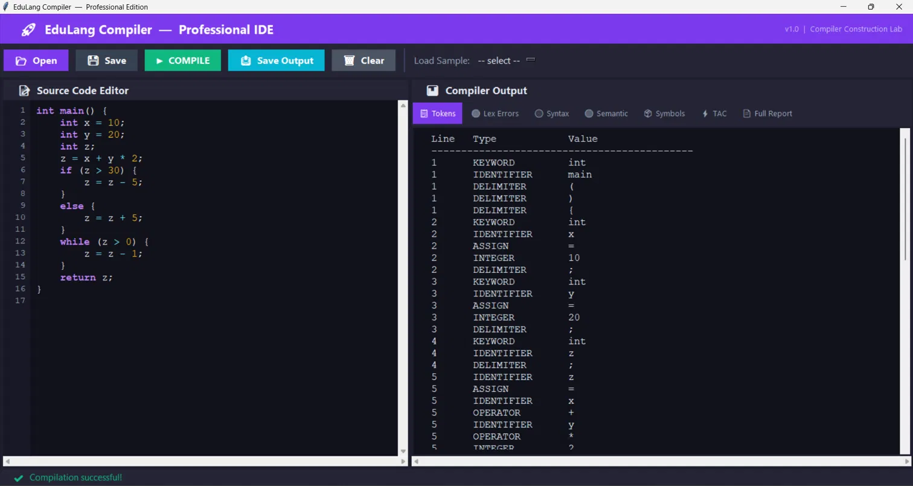
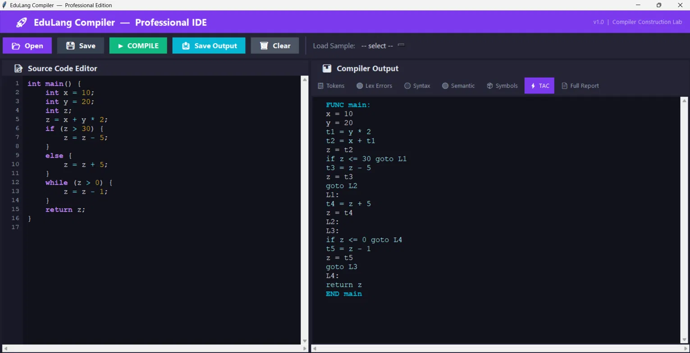
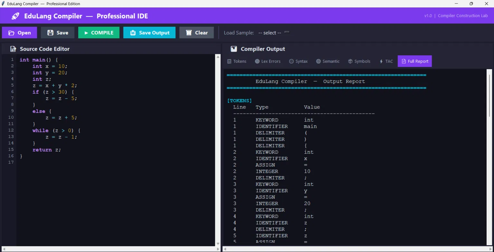
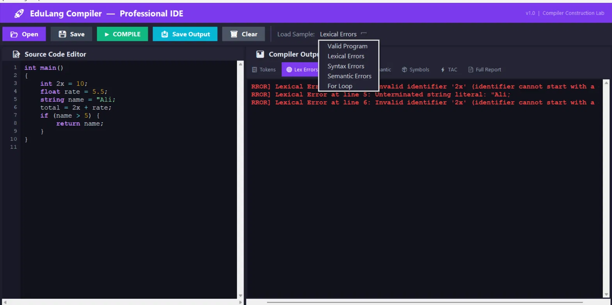
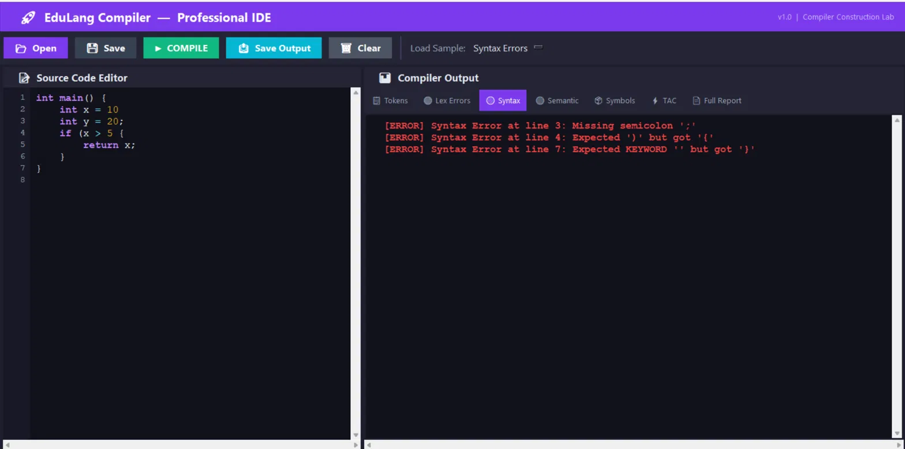
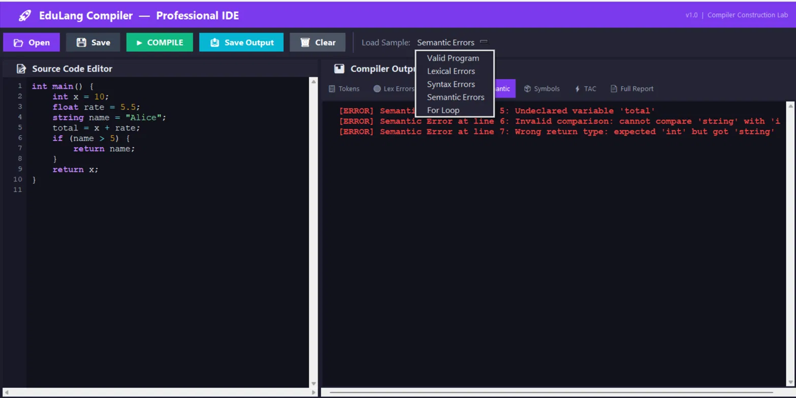

<h1 align="center">🚀 EduLang Compiler</h1>
<h3 align="center">A Full-Stack Compiler with a Professional Desktop IDE</h3>

<p align="center">
  <b>Lexer → Parser → Semantic Analyzer → Three Address Code — built from scratch in Python, wrapped in a custom GUI.</b>
</p>

<p align="center">
  
  
  
</p>

---

## 📖 Overview

**EduLang Compiler** is a complete compiler front-end for **EduLang** — a small C-style teaching language — built as a Compiler Construction lab project. It takes raw EduLang source code through every classical compilation stage: **lexical analysis → syntax parsing → semantic checking → Three Address Code (TAC) generation**, and presents the result in a polished, professional desktop IDE rather than a plain console output.

EduLang supports variable declarations, arithmetic expressions with correct operator precedence, assignment, `if`-`else` statements, `while` loops, `for` loops, and `return` statements.

---

## ✨ Features

- 🧩 **Lexical Analyzer** — tokenizes source code and flags invalid identifiers, unterminated strings, invalid characters, and malformed numeric literals
- 🌳 **Syntax Analyzer** — validates program structure with correct operator precedence, reporting missing semicolons, parentheses, and braces with line numbers
- ✅ **Semantic Analyzer** — detects undeclared variables, type mismatches, invalid comparisons, and incorrect return types
- 🔁 **`for` loop support** — full lexer, grammar, parser, and semantic-checking extension for `for (init; condition; update) { ... }`, in addition to `while` loops
- ⚙️ **Three Address Code (TAC) generation** — converts valid programs into optimized intermediate code with proper label/jump handling for control flow
- 🖥️ **Professional Desktop IDE** — built with CustomTkinter: source editor, tabbed output (Tokens / Lex Errors / Syntax / Semantic / Symbols / TAC / Full Report), and one-click sample loading
- 📄 **Exportable reports** — full compilation report (tokens, errors, symbol table, TAC) can be saved to `output.txt`

---

## 📸 Preview

**Tokens & Compiler Output**
<p align="center"></p>

**Three Address Code Generation**
<p align="center"></p>

**Full Compilation Report**
<p align="center"></p>

**Lexical Error Detection**
<p align="center"></p>

**Syntax Error Detection**
<p align="center"></p>

**Semantic Error Detection**
<p align="center"></p>

---

## 🧪 Example

**Input (EduLang):**
```c
int main() {
    int x = 10;
    int y = 20;
    int z;
    z = x + y * 2;
    if (z > 30) {
        z = z - 5;
    } else {
        z = z + 5;
    }
    while (z > 0) {
        z = z - 1;
    }
    return z;
}
```

**Generated Three Address Code:**
```
FUNC main:
x = 10
y = 20
t1 = y * 2
t2 = x + t1
z = t2
if z <= 30 goto L1
t3 = z - 5
z = t3
goto L2
L1:
t4 = z + 5
z = t4
L2:
L3:
if z <= 0 goto L4
t5 = z - 1
z = t5
goto L3
L4:
return z
END main
```

---

## 🐞 Error Detection Examples

**Lexical errors:**
```c
int 2x = 10;              // Invalid identifier '2x'
string name = "Ali;       // Unterminated string literal
```

**Syntax errors:**
```
[ERROR] Syntax Error at line 3: Missing semicolon ';'
[ERROR] Syntax Error at line 4: Expected ')' but got '{'
```

**Semantic errors:**
```
[ERROR] Semantic Error at line 5: Undeclared variable 'total'
[ERROR] Semantic Error at line 6: Invalid comparison: cannot compare 'string' with 'int'
[ERROR] Semantic Error at line 7: Wrong return type: expected 'int' but got 'string'
```

---

## 🔁 `for` Loop Extension

EduLang was extended beyond its original `while`-only design to support `for` loops end-to-end:

**Grammar:**
```
ForStatement    -> for ( Initialization ; Condition ; Update ) { StatementList }
Initialization  -> Type Identifier = Expression | Identifier = Expression
Condition       -> Expression RelationalOperator Expression
Update          -> Identifier = Expression
```

**Example:**
```c
for (int i = 0; i < 3; i = i + 1) {
    x = x + i;
}
```

**Generated TAC:**
```
i = 0
L1:
if i >= 3 goto L2
t1 = x + i
x = t1
t2 = i + 1
i = t2
goto L1
L2:
```

The semantic analyzer also validates `for` loops — checking that the loop variable is properly declared, the condition is a valid relational expression, and the update target is declared.

---

## 🛠️ Tech Stack

| Component | Technology |
|---|---|
| **Language** | Python |
| **GUI Framework** | CustomTkinter |
| **Compiler Stages** | Hand-written Lexer, Recursive-Descent Parser, Semantic Analyzer, TAC Generator |

---

## 📁 Project Structure

```
edulang-compiler/
├── main.py              # Application entry point / GUI
├── lexer.py               # Lexical analyzer
├── parser.py               # Syntax analyzer
├── semantic_analyzer.py      # Semantic analyzer
├── tac_generator.py            # Three Address Code generator
├── samples/                      # Sample EduLang programs (valid + error cases)
└── output.txt                      # Generated compilation report
```

---

## ⚙️ Getting Started

```bash
git clone https://github.com/shehryar-spec/edulang-compiler.git
cd edulang-compiler
pip install customtkinter
python main.py
```

Load one of the built-in samples from the **"Load Sample"** dropdown (Valid Program, Lexical Errors, Syntax Errors, Semantic Errors, For Loop) or write your own EduLang code, then hit **Compile**.

---

## 🎯 Supported Language Features

- Variable declarations (`int`, `float`, `string`)
- Arithmetic expressions with correct operator precedence
- Assignment statements
- `if` / `else` conditionals
- `while` loops
- `for` loops
- `return` statements
- Relational & comparison operators

---

## 👤 Author

**Shehryar Asif**
Computer Science Undergraduate, University of Wah

[GitHub](https://github.com/shehryar-spec) · [LinkedIn](https://www.linkedin.com/in/shehryar-asif-87107139a) · [Portfolio](https://shehryar-spec.github.io/portfolio/)
